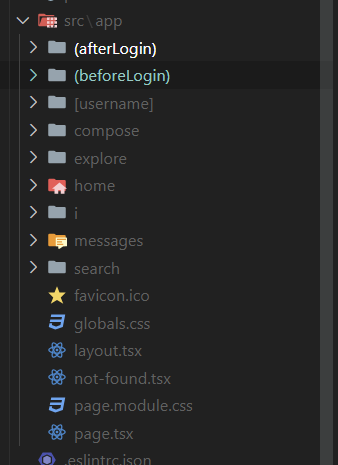

# 프로젝트 생성

```
npx create-next-app@latest
```

- project name
- TypeScript
- ESLint
- TailWind CSS (X)
- src/directory
- App Router
- import alias(X) 절대 경로 `src폴더: @`

```
npm run dev
```

# 폴더구조



> `[]` 변경값
>
> `()` 폴더 주소는 app/(afterLogin)/home 이어도 블아주에서는 /home 임

`template.tsx`와 `layout.tsx`의 차이

페이지가 넘나들 때 매번 새롭게 마운트되게 하고 싶으면 template으로 하면 됨

# CSS 선택

- tailwind -> 호불호 너무 심하고, 가독성 x
- Styled Component -> Server Component SSR
- sass
- css module -> 간단하게
- vanille extract -> Windows와 문제

`dvw`, `dvh` 새로운 단위, 모바일 뷰에 주소창이 생기거나 꺼질 때 그런 거에 상관없이 전체화면에 채울 수 있음
