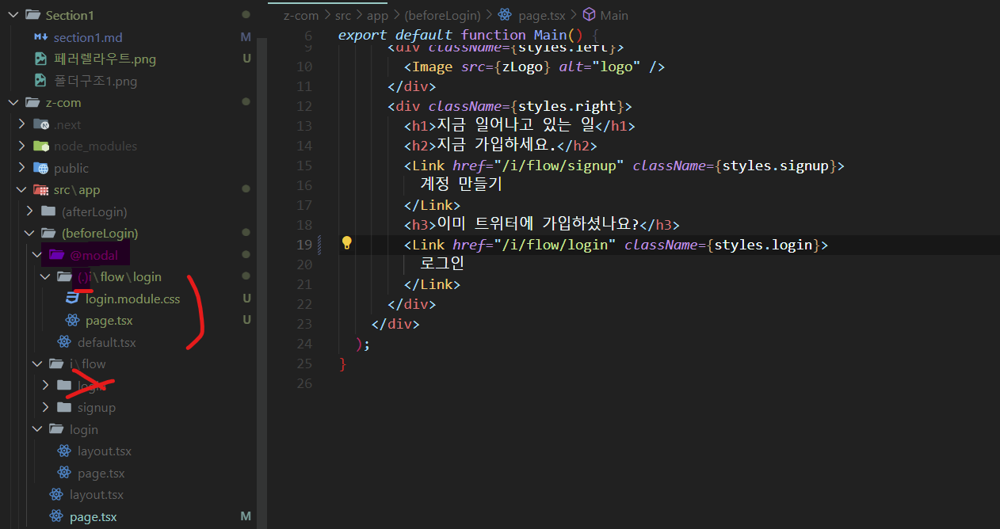

\*\*\*# 프로젝트 생성

- 화면을 어떻게 만들 것인가?
- 주소 체계를 파악해야 함

폴더를 만들 곳에

```
npx create-next-app@latest
```

- project name
- TypeScript
- ESLint
- TailWind CSS (X)
- src/directory
- App Router
- import alias(X): import alias를 커스터마이징 할 거냐. 절대 경로 `src폴더: @`

```
npm run dev
```

# 폴더구조


> public 폴더: 모든 사람들이 접근할 수 있는 이미지 폴더만 넣어 놓기
>
> src 폴더: typescript 파일들을 묶어두는 것 (app, mock ...)
>
> app 폴더: 주소와 관련된 파일들만 들어감
>
> next.config.js: next에 대한 설정임
>
> tsconfig.json: typescript 설정 파일
>
> `[]` 변경값 (slug): 다이나믹 라우팅, 많은 유저들 누구든 간에 해당할 수 있게
>
> - `[]`의 값이 다른 주소 폴더와 겹친다면 제일 후순위임
> - 겹친다면, 사용할 수 없게 하는 것이 맞음
>
> `()` 폴더 주소는 app/(afterLogin)/home 이어도 블아주에서는 /home 임 -> 주소창에 관여를 하지 않지만, 그룹을 만들 수 있음
>
> 또, 레이아웃을 만들 수 있음
>
> not-found.tsx: 다른 주소에 안 걸릴 때 나오는 페이지
>
> home, \[username\] 등 만의 레이아웃을 만들고 싶다면 해당 폴더 안에 layout.tsx를 따로 만들면 됨
>
> 계층 구조임 RootLayout -> HomeLayout -> Home
>
> ```tsx
> export default function Layout({ children }: { children: React.ReactNode }) {
>   return <div>{children}</div>;
> }
> ```

# 브라우저 주서 app폴더에 반영하기

레이아웃: 페이지를 넘나 드는데도 안 바뀌는 것

app -> layout.tsx의 RootLayout: 최상위 레이아웃

페이지를 넘나들때마다 `children`에 쏙 들어가는 것임

```tsx
export default function RootLayout({
  children,
}: {
  children:React.ReactNode
}) {
  return (
    <html lang = "en">
      <body className = {inter.className}>{children}</body></body>
    </html>
  )
}
```

> 이 강의에서 로그인을 했을 때와 안 했을 때 레이아웃이 다르다는 것을 기억해라

`template.tsx`와 `layout.tsx`의 차이

페이지가 넘나들 때 매번 새롭게 리렌더링(..마운트 개념이 더 적절할지도)이 되게 하고 싶으면 `template`으로 하면 됨

-> template와 layout은 공존하면 안 됨

# CSS 선택

- tailwind -> 호불호 너무 심하고, 가독성 x
- Styled Component-> Server Component SSR
- sass
- css module -> 간단하게 가자
  > 장점: css를 styles로 import할 수 있음
- vanilla extract -> Windows와 문제

```tsx
import styles from "./page.module.css";

// 컴포넌트의 일부
<div className={styles.right}>hi</div>;
```

```css
// page.module.css

.container {
  display: flex;
  flex-direction: row;
  background-color: #fff;
  width: 100dvw;
  height: 100dvh;
}
```

`dvw`, `dvh` 새로운 단위, 모바일 뷰에 주소창이 생기거나 꺼질 때 그런 거에 상관없이 전체화면에 채울 수 있음

# 패러렐 라우트

- Parellel Routes

  > `@이름`폴더 생성, 밑에 페이지 같은 폴더 안에 있어야 함
  > 
  > 같은 폴더 아래에 있어야 함

- Intercepting Routes

# 타입스크립트란?

변수, 매개변수, 리턴값에 타입을 지정해주는 것임

# 클라이언트 컴포넌트로 전환하기

서버 컴포넌트는 `async` 붙일 수 있음 비동기로 컴포넌트를 만들 수 있음

> `useState`, `useEffect`와 같은 hooks은 사용할 수 없음

서버 컴포넌트(데이터와 관련있음) -> 클라언트 컴포넌트

```
use client;
```

# default.tsx


@modal 바로 밑이 아닌 경로에 Parallel Routes가 없으면 404 Not found

그래서 default.tsx가 필요한 것임

> default.tsx Parallel Rotues의 기본값
>
> 보통 Paralle Routes가 필요 없을 때 혹은 기본값

레이아웃 입장에서

> 주소가 localhost:3001일 때는 children -> page.tsx, modal -> @modal/default.tsx
>
> 주소가 localhost:3001/i/flow/login 일 때는 children -> i/flow/login/page.tsx, modal -> @modal/i/flow/login/page.tsx

# 인터셉팅 라우트

서로 주소가 다른데 같이 뜰 수 있게 해주는 것



> 원래는 밑의 i>flow>login으로 가야하는데
>
> Pareller Routes 밑의 Intercepting Routes 에 있어 거기로 감 `가로챔`
>
> Pareller Routes이기 때문에 children이 아니 modal임 -> 기존 화면 위의 뜸
>
> 그러면 i>flow>login은 필요 없는 것인가?
>
> 아니다. 가로채기(Link를 통해)가 아닐 때, 필요함 ex. 브라우저에서 들어갈 때, 새로고침

클라이언트에서 라우팅할 때만 인터셉트 라우팅이 적용됨

# private folder(\_폴더)

주소창에 안 뜨는 세 가지

- \(그룹 폴더\) : 레이아웃
- 페러렐 라우트: ex\) @modal: 한 화면에 두 개의 페이지를 동시에 보여주는 것
- \_private folder: 폴더 정리용

> (이 문장은 확실하지 않을 수 있음 주의)
>
> 클라이언트 컴포넌트가 서버 컴포넌트를 import하면 서버 컴포넌트가 클라이언트 컴포넌트로 바뀜

> 원칙: 서버컴포넌트만 클라이언트컴포넌트를 import 할 수 있음

# 로그인 모달에서 발생하는 문제 해결하기(router.replace)

css.module에다가 scss를 도입하면 기능이 좋아짐

> 인터셉팅 라우트는 서버쪽에서 관여하는 것이 아니라
>
> 클라이언트에서 페이지를 넘어갔을 때 관여하는 것임

```tsx
import { redirect } from "next/navigetion";

export default function Login() {
  redirect("url"); // 여기서 redirect는 서버에서 보내는 것임
  //    인터셉팅이 제대로 되지 않음
  //    Link를 통해서만 인터셉팅이 제대로 됨
}
```

-> 클라이언트 redirect으로 바꿔줘야 함

```js
"use client";

import { useRouter } from "next/navigation";

export default function Login() {
  const router = useRouter();
  router.replace("href");
  //    router.push("href");
  return null;
}

// router.push
// localhost:3001 -> localhost:3001/login -> localhost:3001/i/flow/login

// router.replace
// localhost:3001 -> localhost:3001/i/flow/login
```

-

*
*
*
