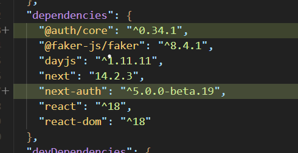

# 그런데 백엔드 개발자가 API를 아직 못 만들었다.

http 공부랑

cookie 공부해라

## mocks

패키지 설치

```
npx msw init public/ --save
```

> public -> mockServiceWorker.js
>
> 서버 주소로 보내는 요청을 가로챔
>
> 실제 서버에 요청을 보내는 것처럼 보이지만, mockServiceWorker에서 주는 것임

### 실행

```
npm run mock
```

### 개발 중일 때

`.env 파일` : 배포 환경용

`.env.local`: 개발 환경용

```
NEXT_PUBLIC_API_MOCKING = enabled
```

> NEXT_PUBLIC이라면 브라우저 환경에서 변수에 접근이 가능함

```
API_MOCKING
```

> 브라우저에서 접근 불가능함

> 브라우저에서도 접근해도 되는 환경변수냐 아니냐를 구분해야 함

### cookie

```js
   {
        method: "post",
        body: formData,
        credentials: "include", // cookie를 위해 필요한 코드
      }
```

### redirect

`try catch문`에서 사용하면 안 됨

```js
let shouldRedirect = false;

try {
  shouldRedirect = true;
} catch {}

if (shouldRedirect) {
  redirect("/home");
}
```

## auth.js

### 설치

```
npm i next-autho@beta @auth/core
```



> app > auth.ts, middleware.ts
>
> app > api > auth > [...nextauth] > route.ts

공식문서 언급해주신 것

NEXT.js

> API Routes
>
> catch-all Segments

### Login

클라이언트에서는

```
import { signIn } from "next-auth/react";
```

서버 환경에서는

```
import { signIn } from "@/auth"
```

### useSession

클라이언트측에서 내 정보 불러오는 법

## tanStack Query v5

### 설치

```
npm i @tanstack/react-query

npm i @tanstack/react-query-devtools
```

### Redux가 아닌 react-query, swr를 사용하는 이유?

`react-query`의 핵심은 서버의 데이터를 가져오는 것

> 캐싱을 잘해줌
>
> 사용자의 요청량이 커지면서 트래픽 관리를 잘해야 함 -> 데이터를 최대한 캐싱을 많이 하는 것이 중요함(임시 저장소)

> 그렇기 때문에,
>
> 1. 일주일 한 번 정도 비교 후 업데이트
>
> 2. 수정을 하는 액션을 보고 그 때 캐시를 찾아서 DB와 캐시를 같이 업데이트

> redux처럼 컴포넌트간의 데이터 공유를 하지 못하냐?
>
> 아님 할 수 있음
>
> ```
> 강의 처럼, query.getClient
> ```

`redux`는 데이터를 컴포넌트간의 공유하는 것

> 캐싱이 약함

### react-query 설명

#### 상태

- Fresh: 데이터를 서버에서 가져왔을 때, 최신 데이터

  ```
  react-query의 기본은 모든 데이터는 fresh가 아니다.
  ```

- Stale: 기회가 되면 항상 데이터를 새로 가져오길 바람
  ```tsx
  queries: {
          refetchOnWindowFocus: false, //(1) 탭 전환할 때
          retryOnMount: true,          //(2) 컴포넌트가 언마운트 되었다가 마운트 되었을 때
          refetchOnReconnect: false,   //(3) 인터넷 연결이 끊겼다가 다시 접속이 될 때
          retry: false,                //(4) 데이터를 가져왔을 때 재시도
        },
  ```
- Inactive:

```tsx
export default function PostRecommends() {
  const { data } = useQuery<IPost[]>({
    queryKey: [??],
    queryFn: ??,
    staleTime: 60 * 1000, // fresh -> stale
    gcTime: ??
  });

  return data?.map((post) => <Post key={post.postId} post={post} />);
}

```

> staleTime은 gcTime보다 항상 짧아야 함
>
> gcTime은 statleTime보다 길어야 함

## error 확인 법

console.dir(); 도 있음

## 인피니트 스크롤링

### 1

해당 페이지에

```
prefetchInfiniteQuery
```

```tsx
const queryClient = new QueryClient();
await queryClient.prefetchInfiniteQuery({
  queryKey: ["posts", "recommends"],
  queryFn: getPostRecommends,
  initialPageParam: 0, // 처음 cursor 값
});
```

```tsx
export default function PostRecommends() {
  const { data } = useInfiniteQuery<
    IPost[],
    Object,
    InfiniteData<IPost[]>,
    [_1: string, _2: string],
    number
  >({
    queryKey: ["posts", "recommends"],
    queryFn: getPostRecommends,
    initialPageParam: 0, // [1, 2, 3, 4, 5], [6, 7, 8, 9, 10], [11, 12, 13, 14, 15]
    getNextPageParam: (lastPage) => lastPage.at(-1)?.postId,
    staleTime: 60 * 1000, // fresh -> stale
    gcTime: 300 * 1000,
  });
...
```

### 2

`react-intersection-observer`
